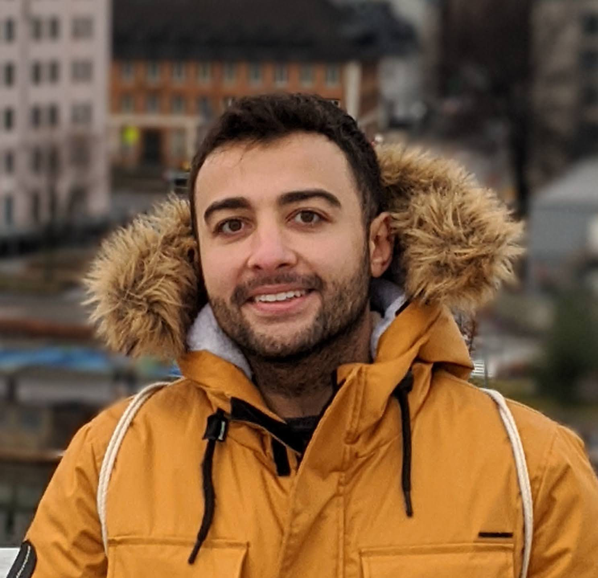

Software engineer and Android Developer since Ice Cream Sandwich. I enjoy traveling, photography, playing table tennis, padel, chess and coding Android apps. I always enjoy to learn and use edge technologies with open mindset. A "Harry Potter books" fan, open source lover and clean code reader.

[See my Resume here](/assets/files/MelihGultekinCV.pdf){: .btn .btn--primary .btn--small}

## Certificates

| Name                                                                                                                                        | Issuer           | Issued date | Link                                                                                                                                                                                    |
|---------------------------------------------------------------------------------------------------------------------------------------------|------------------|-------------|-----------------------------------------------------------------------------------------------------------------------------------------------------------------------------------------|
| &nbsp;&nbsp; Android Development Security                          | defdeveudefdeveu | Oct 2023    | [Download credential](/assets/files/defdev-certificate.2309i.android-blue.exam.axj42k-879c.melih-gultekin.pdf){: .btn .btn--primary .btn--small}                                        |
| &nbsp;&nbsp; Graph Developer - Associate                      | Apollo GraphQL   | Jan 2023    | [Show credential](https://www.apollographql.com/tutorials/certifications/a924e48b-a9c7-48d7-b68c-455dd2253043)                                                                          |
| &nbsp;&nbsp; A Toolkit for Giving and Receiving Better Feedback     | LinkedIn         | Apr 2021    | [Show credential](https://www.linkedin.com/learning/certificates/120e696d804e90dfbae36aca80c4c02529e2a6d62a221e83aa6e1355e492d298?trk=backfilled_certificate)                           |
| &nbsp;&nbsp; Android Developer Nanodegree                            | Udacity          | Feb 2018    | [Show credential](https://www.udacity.com/certificate/GLPTTHRH)                                                                                                                         |
| &nbsp;&nbsp; Tech Reliability Fundamentals @ING                    | Udemy & ING      | Dec 2023    | [Show credential](https://www.udemy.com/certificate/UC-292cb2f7-3de1-4970-b664-77fd5f95389e/)                                                                                           |
| &nbsp;&nbsp; Android Accessibility Features                        | Deque University | Apr 2023    | [Download credential](/assets/files/Melih-Gultekin-Android-Accessibility-Features_Course-Completion-Certificate.pdf){: .btn .btn--primary .btn--small}                                  |
| &nbsp;&nbsp; Accessibility Fundamentals - Disabilities, Guidelines | Deque University | Apr 2023    | [Download credential](/assets/files/Melih-Gultekin-Accessibility-Fundamentals---Disabilities,-Guidelines,-and-Laws_Course-Completion-Certificate.pdf){: .btn .btn--primary .btn--small} |

## Media

Not my thing but here my only appearance:

* [Google Glass at bol.com: A different way of looking at Technology
](https://techlab.bol.com/en/blog/google-glass-at-bol-com-a-different-way-of-looking-at-technology) with Niels de Vries, Erick Webbe
